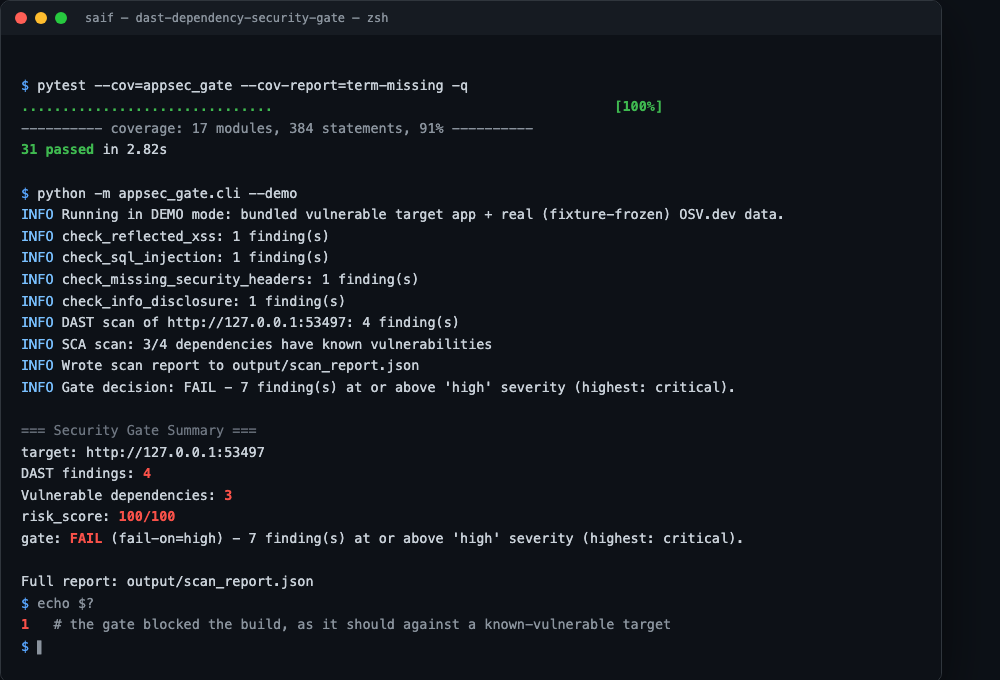
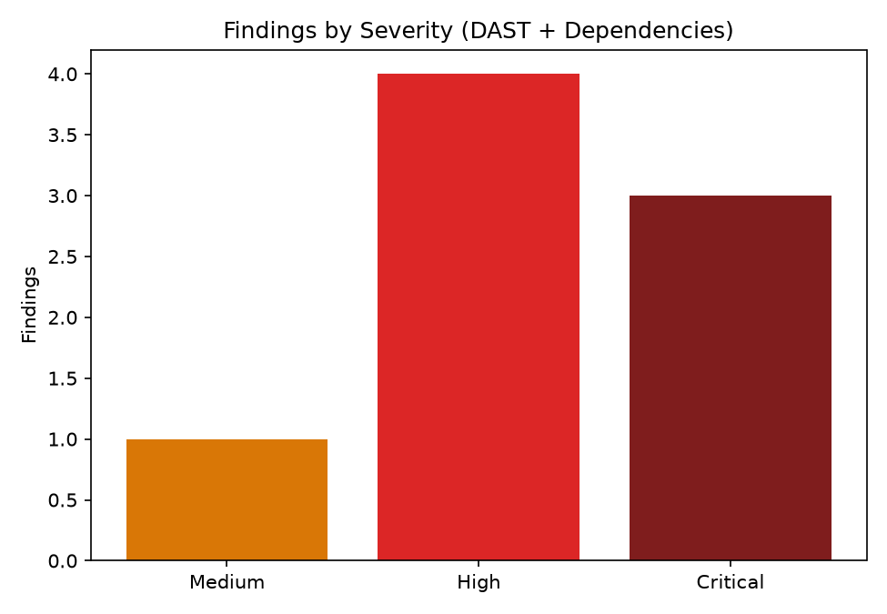
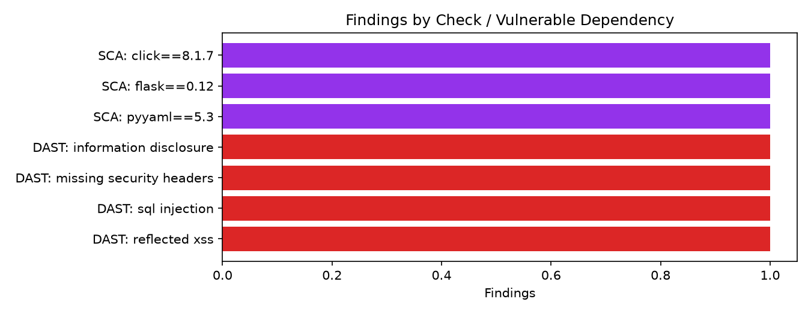
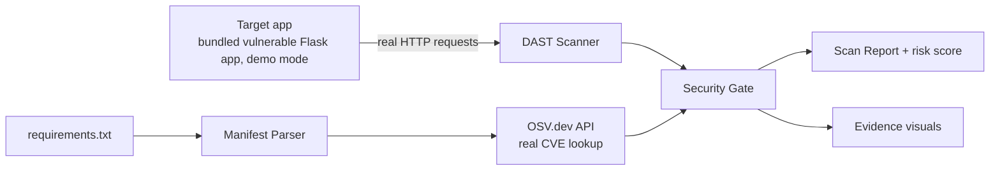
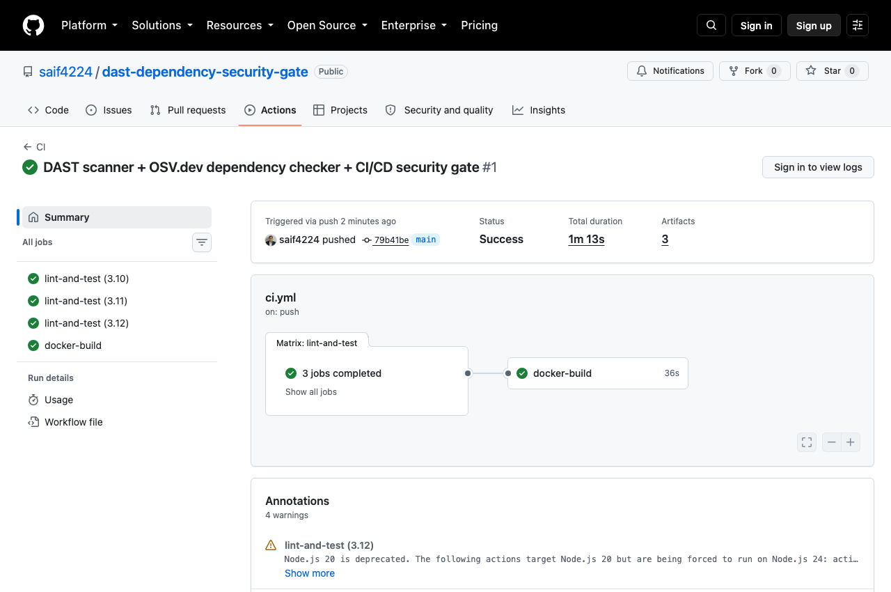

# DAST + Dependency (SCA) Security Gate

[](https://github.com/saif4224/dast-dependency-security-gate/actions/workflows/ci.yml)
[](.github/workflows/ci.yml)
[](LICENSE)

A CI/CD security gate, not just a scanner: it sends real HTTP requests to a running app to catch
**reflected XSS, SQL injection, missing security headers, and information disclosure**, checks a
`requirements.txt` against the real **[OSV.dev](https://osv.dev/)** vulnerability database, and then
— the part that makes it a *gate* rather than a report — **enforces a severity threshold via its
exit code**, so a CI pipeline can actually block a build on it.

```
Vulnerable target app ──► DAST scan (real HTTP) ──┐
                                                    ├──► Gate decision ──► exit 0/1
requirements.txt ──► OSV.dev CVE lookup ───────────┘         + scan_report.json + evidence visuals
```

**Proof, not just a claim:** this repo's own CI has a step that runs the gate against the bundled
vulnerable target and asserts it exits 1 — see the CI screenshot below. If the gate ever stopped
catching real bugs, this repo's own pipeline would fail.

## Why this exists

A vulnerability scanner that only *reports* is advisory - someone has to read it, decide, and
manually block the merge. A security *gate* makes that decision automatically and enforceably: wire
it into CI, set a severity threshold, and vulnerable code stops shipping without a human in the
loop for the common case. That's the actual DevSecOps pattern this project automates, using two
real, independent detection sources (dynamic testing + dependency intelligence) rather than one.

## Quickstart (demo mode)

```bash
git clone https://github.com/saif4224/dast-dependency-security-gate.git
cd dast-dependency-security-gate
pip install -r requirements.txt
python -m appsec_gate.cli --demo
```

This spins up a small **bundled, deliberately vulnerable Flask app** on localhost, scans it live
with real HTTP requests (not mocked), checks its dependency manifest against real (fixture-frozen)
OSV.dev data, and evaluates the gate. Because the target is deliberately vulnerable, **the gate
correctly fails and the process exits with code 1** - see it happen:



Want to see the report without the exit code (e.g. just exploring)? Add `--report-only`. Or via Docker:

```bash
docker compose up --build
```

## Live mode (real infrastructure)

```bash
python -m appsec_gate.cli --live \
  --target http://localhost:8000 \
  --requirements requirements.txt \
  --fail-on high
```

Both are optional independently. **Only ever point `--target` at an application you own and are
authorized to test** - see [Scope & safety](#scope--safety).

## Sample output

`scan_report.json` (truncated):

```json
{
  "target": "http://127.0.0.1:53497",
  "dast_findings": [
    { "check_name": "sql_injection", "severity": "critical",
      "description": "The 'id' parameter is concatenated directly into a SQL query (error-based SQLi)." }
  ],
  "dependency_findings": [
    { "package": "pyyaml", "version": "5.3",
      "vulnerabilities": [{ "vuln_id": "GHSA-6757-jp84-gxfx", "severity": "critical",
                             "aliases": ["CVE-2020-1747", "PYSEC-2020-96"] }] }
  ],
  "gate": { "passed": false, "fail_on": "high", "blocking_findings": 7,
            "reason": "7 finding(s) at or above 'high' severity (highest: critical)." },
  "risk_score": 100
}
```

Evidence visuals, generated on every run:

| Findings by severity | Findings by check / dependency |
|---|---|
|  |  |

## Architecture



See [`docs/architecture.md`](docs/architecture.md) for why the DAST target is a bundled app rather
than a fixture (dynamic testing means observing something actually running) and why the OSV.dev
fixture is frozen *real* API data, not fabricated CVEs. Short version:

| Stage | What it does |
|---|---|
| **Target** | A small, self-contained, deliberately vulnerable Flask app - the scanner's only ever-authorized target |
| **DAST** | Real HTTP checks: reflected XSS, SQL injection, missing security headers, information disclosure |
| **SCA** | Parses `requirements.txt`, queries OSV.dev for known CVEs per pinned version |
| **Gate** | Compares every finding against `--fail-on`, decides pass/fail, sets the exit code |
| **Reporting** | Consolidated JSON + severity/type-distribution visuals |

## Testing

```bash
pip install -r requirements-dev.txt
pytest --cov=appsec_gate
ruff check .
```

Tests spin up the bundled vulnerable app on a real localhost socket and run genuine HTTP checks
against it - no mocked responses. GitHub Actions runs lint + tests across Python 3.10-3.12, a
report-only demo run, **a dedicated step that asserts the gate blocks the vulnerable target (exit
code 1)**, and a Docker build/smoke-test on every push — see [`.github/workflows/ci.yml`](.github/workflows/ci.yml).



## Scope & safety

- **The DAST scanner only ever targets the bundled, self-contained demo app** in this repo's
  default configuration. `--live --target` lets you point it elsewhere - **only ever use that
  against infrastructure you own and are explicitly authorized to test.** Every check is a
  read-only probe (send a request, inspect the response); nothing here exploits, modifies, or
  exfiltrates data.
- **The vulnerable target app is real but harmless.** `appsec_gate/target/vulnerable_app.py` is a
  ~70-line Flask app with three intentional bugs, clearly commented, running only on localhost -
  not a production codebase, not exposed anywhere by default.
- **The OSV.dev dependency data is real, not fabricated.** `data/osv_fixture.json` is a frozen copy
  of an actual OSV.dev API response for the exact packages in `data/demo_requirements.txt`,
  captured live - see its header comment for exactly what was queried and when.

## Tech stack

Python 3.10+ · Flask (demo target app) · `requests` (DAST + OSV.dev client) · OSV.dev API (real CVE
data) · `matplotlib` (evidence visuals) · Docker · GitHub Actions

## License

[MIT](LICENSE)
