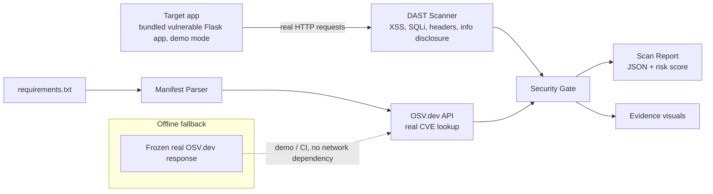

# Architecture

## Stages

| Stage | Module | Responsibility |
|---|---|---|
| Target | `appsec_gate/target/vulnerable_app.py` | A small, self-contained, deliberately vulnerable Flask app - the DAST scanner's only ever-authorized target |
| DAST | `appsec_gate/dast/` | Sends real HTTP requests, checks for reflected XSS, SQL injection, missing security headers, information disclosure |
| SCA | `appsec_gate/sca/` | Parses a requirements.txt, queries OSV.dev (real, free, no-auth API) for known CVEs per pinned version |
| Gate | `appsec_gate/gate/security_gate.py` | Compares every finding against a `--fail-on` severity threshold and makes the actual pass/fail call |
| Reporting | `appsec_gate/report/` | Consolidated JSON + severity/type-distribution visuals |

`appsec_gate/pipeline.py` orchestrates the DAST scan (necessarily live - dynamic testing means observing a real running app) against already-produced dependency findings, which is what keeps the SCA/gate/report path unit-testable while still exercising a genuine HTTP scan in every test run - see `tests/`, which spin up the bundled target on a real localhost socket.

## Why the DAST target is a bundled app, not a fixture

Static analysis and dependency lookups can be meaningfully "faked" with a frozen fixture because their inputs are files. Dynamic testing can't - a DAST scanner's entire job is observing how a *running* application actually behaves. So instead of mocking HTTP responses, this repo ships a small, minimal, deliberately vulnerable Flask app (`appsec_gate/target/vulnerable_app.py`) and runs a real scan against it - the same "authorized, self-owned target only" posture as a DVWA/Juice Shop style training app, kept in-repo so the demo is self-contained. **The scanner must only ever be pointed at infrastructure you own and are authorized to test.**

## Why the OSV.dev fixture is real, frozen data

`data/osv_fixture.json` is not invented. It's a frozen copy of an actual response from the real [OSV.dev API](https://osv.dev/) (Google's open vulnerability database) for the exact packages/versions in `data/demo_requirements.txt`, captured live on 2026-08-22. This keeps CI deterministic and network-independent without fabricating CVE data - `--live` mode queries the real API directly.

## Scope note

The security gate reports and blocks; it never modifies the target, exploits anything, or exfiltrates data - every DAST check is a read-only probe (send a request, inspect the response). `--fail-on` controls the CI/CD enforcement threshold; `--report-only` disables enforcement (always exits 0) while still reporting what the gate would have decided.
